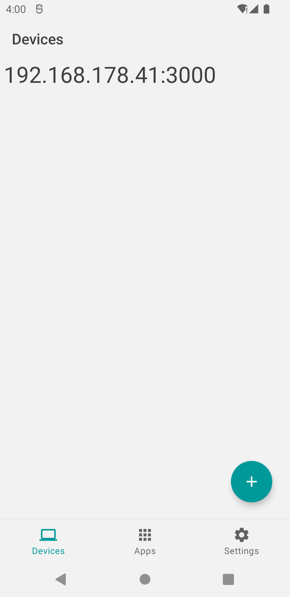
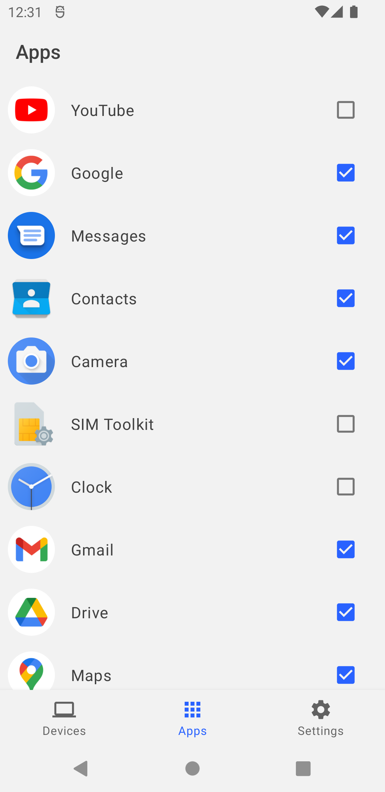
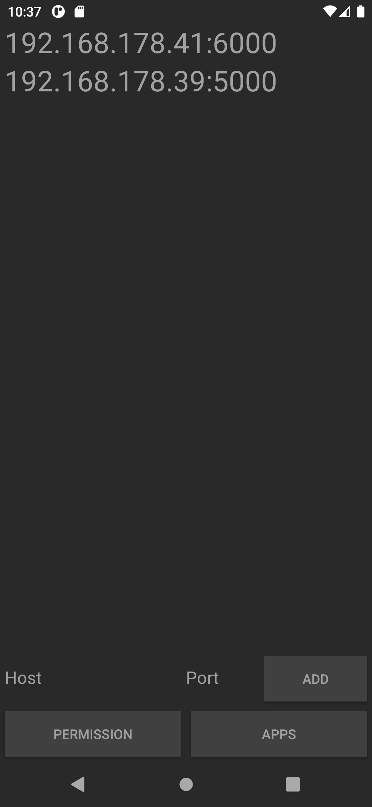

# Android 2 Linux Notifications App

**Android 2 Linux Notifications** (**A2LN**) is a way to display your Android phone notifications on your Linux computer. This repository contains the app part of A2LN.

A brief introduction and a tutorial can be found [here](https://patri9ck.github.io/a2ln/).

## License
A2LN is licensed under the [GPL3](LICENSE).

## Screenshots

  
  
  

